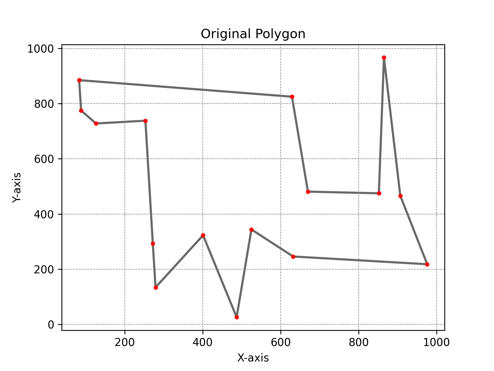
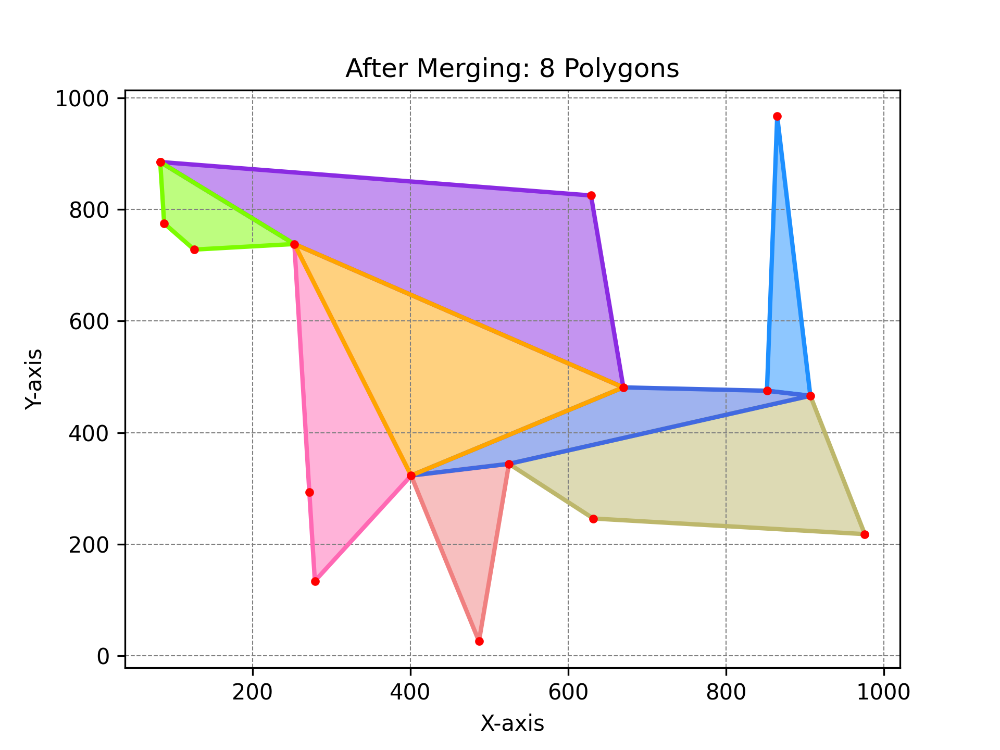
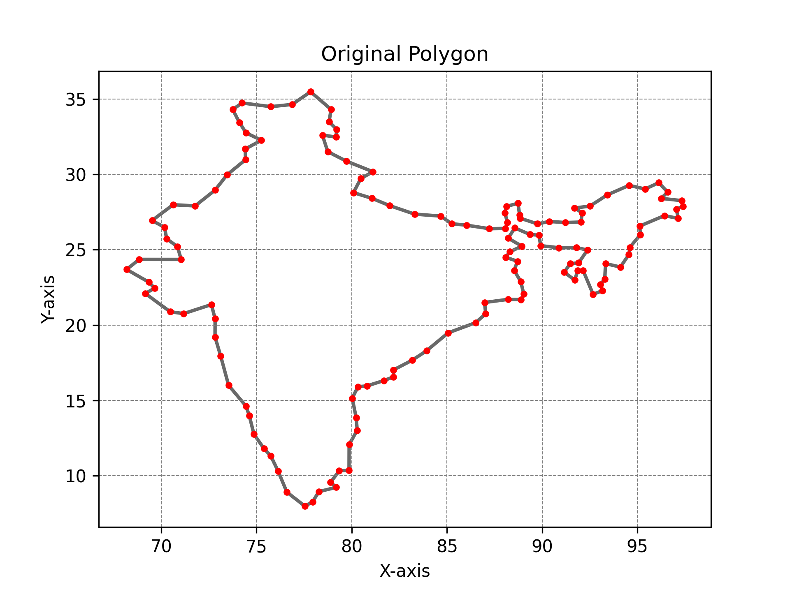
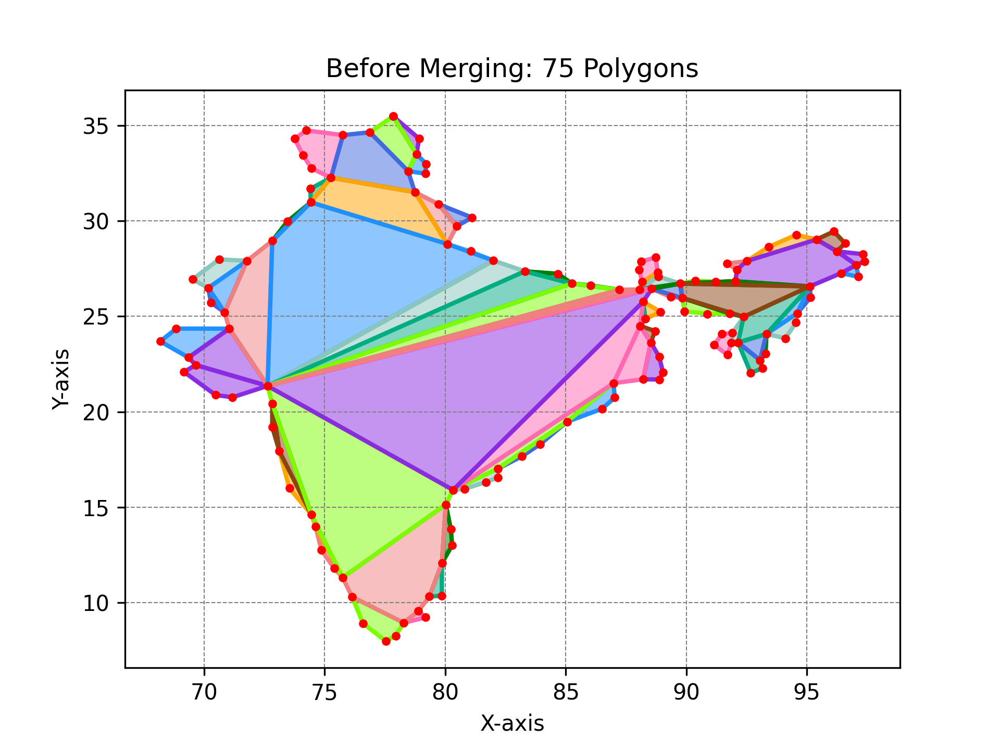
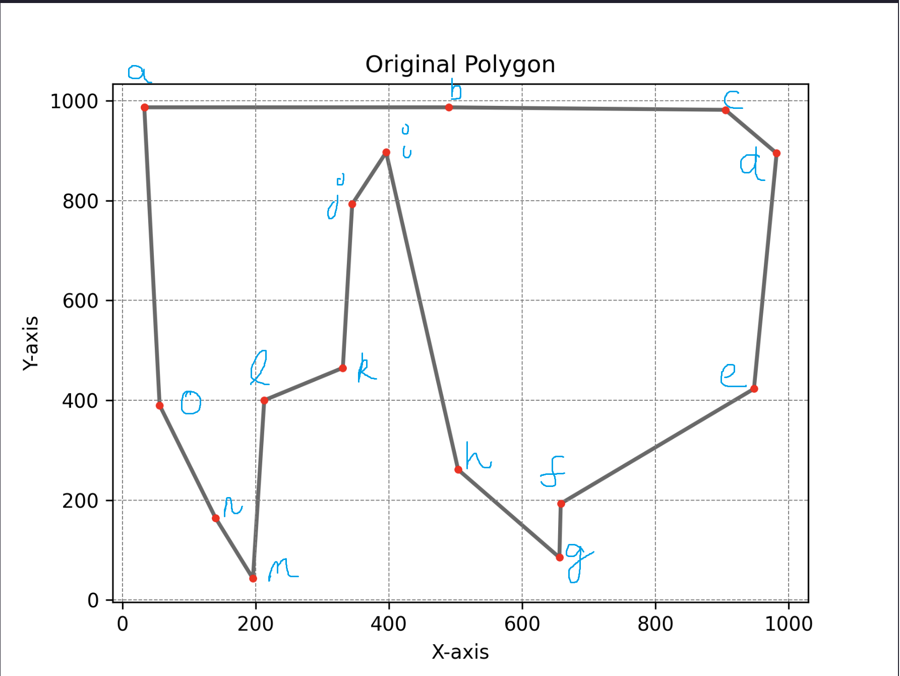

# <center>CSF364: Design and Analysis of Algorithms</center>
### <center>Assignment 1: Decomposition of simple polygons into convex polygons</center>
#### <center>Ashwin Arun (2020A7PS1291H)</center>
#### <center>Kavyanjali Agnihotri (2020A7PS0185H)</center>
#### <center>Tushar Brijesh Chenan (2020A7PS0253H)</center>

## Introduction

In this assignment, we were required to implement the research paper: [Algorithms for the decomposition of a polygon into convex polygons](https://doi.org/10.1016/S0377-2217%2899%2900033-8)

The paper primarily focuses on $2$ objectives:

1. Decomposing a given simple polygon into several non-overlapping convex polygons without the addition of any extra vertices.
2. Merging two or more convex polygons of the planar subdivision obtained above so as to reduce the number of convex polygons in the decomposition.

Our additional tasks were as follows:

1. Store the planar subdivision in a structure known as a [DCEL](https://en.wikipedia.org/wiki/Doubly_connected_edge_list) which allows us to effectively represent and query planar subdivisions.
2. Write a program to visualize the output of the algorithm, i.e, given a simple polygon, output the decomposition produced by the algorithm in a visually intuitive way.

## DCEL: The What and The How

Explain DCEL here

## Plotting the outputs

`plot.py` takes the following as **input files**:

- `input.txt`: First line is the number of coordinates in the original polygon followed by its coordinates in clockwise order.
- `before.txt`: First line is the number of polygons generated by the decomposition process. The next lines have the number of coordinates in decomposed polygons followed by their coordinates in clockwise order.
- `after.txt`: First line is the number of polygons after the merging process. The next lines have the number of coordinates in merged polygon followed by their coordinates in clockwise order.

It generates **three** plots as follows:

- `polygon.png`: Plot generated for the original polygon in `input.txt`.
- `before.png`: Plot generated for the decomposed polygons in `before.txt`.
- `after.png`: Plot generated for the merged polygons in `after.txt`. 

### Working:

1. For each input file, the coordinates are converted to floating points and extracted into a list. The starting coordinate is appended to the end of the list to close the polygon.

2. The code plots a simple scatter plot with lines between the consecutive points for the polygon in `input.txt`. The points are colored red.

3. The code plots each decomposition in `before.txt` using the plot function of Matplotlib. These decomposition are filled with a color (among 10 colors) using fill. The points of the original polygon are plotted(in red) using scatter plot on top of these decompositions.

4. Plot is generated for `after.txt` in a similar manner.

## Writing a simple polygon generator

`gen.py` is the script we are using to generate polygons of arbitrary size. The python script uses the `secrets` module which is cryptographically secure which means we have a minimum amount of bias in our randomness.

We first start by generating the number of vertices of our polygon $n$. We will refer to the collection of points as $P$. We then find the leftmost and rightmost endpoints of $P$ and connect them by a line called $l$. Line $l$ divides $P$ into $2$ sets - $U$ and $L$. $U$ is the set of points above the line $l$ and $L$ is the set of points below $l$.

We sort the points of $U$ in increasing order of $x$ coordinates and $L$ in decreasing order of $x$ coordinates. Then we concatenate $U$ with reverse list of $L$ which gives us a simple polygon.

## Sample runs of the code

### Simple polygon with $n = 16$

*input.txt*:

```text
16
83 885
629 825
670 481
852 475
865 967
907 466
976 218
632 246
525 344
487 26
401 323
279 134
272 293
253 738
126 728
88 775
```

*polygon.png*



*before.png*


*after.png*



### Simple polygon representing the boundary of India

Map of India
*input.txt*

```text
135
77.837451 35.49401
78.912269 34.321936
78.811086 33.506198
79.208892 32.994395
79.176129 32.48378
78.458446 32.618164
78.738894 31.515906
79.721367 30.882715
81.111256 30.183481
80.476721 29.729865
80.088425 28.79447
81.057203 28.416095
81.999987 27.925479
83.304249 27.364506
84.675018 27.234901
85.251779 26.726198
86.024393 26.630985
87.227472 26.397898
88.060238 26.414615
88.174804 26.810405
88.043133 27.445819
88.120441 27.876542
88.730326 28.086865
88.814248 27.299316
88.835643 27.098966
89.744528 26.719403
90.373275 26.875724
91.217513 26.808648
92.033484 26.83831
92.103712 27.452614
91.696657 27.771742
92.503119 27.896876
93.413348 28.640629
94.56599 29.277438
95.404802 29.031717
96.117679 29.452802
96.586591 28.83098
96.248833 28.411031
97.327114 28.261583
97.402561 27.882536
97.051989 27.699059
97.133999 27.083774
96.419366 27.264589
95.124768 26.573572
95.155153 26.001307
94.603249 25.162495
94.552658 24.675238
94.106742 23.850741
93.325188 24.078556
93.286327 23.043658
93.060294 22.703111
93.166128 22.27846
92.672721 22.041239
92.146035 23.627499
91.869928 23.624346
91.706475 22.985264
91.158963 23.503527
91.46773 24.072639
91.915093 24.130414
92.376202 24.976693
91.799596 25.147432
90.872211 25.132601
89.920693 25.26975
89.832481 25.965082
89.355094 26.014407
88.563049 26.446526
88.209789 25.768066
88.931554 25.238692
88.306373 24.866079
88.084422 24.501657
88.69994 24.233715
88.52977 23.631142
88.876312 22.879146
89.031961 22.055708
88.888766 21.690588
88.208497 21.703172
86.975704 21.495562
87.033169 20.743308
86.499351 20.151638
85.060266 19.478579
83.941006 18.30201
83.189217 17.671221
82.192792 17.016636
82.191242 16.556664
81.692719 16.310219
80.791999 15.951972
80.324896 15.899185
80.025069 15.136415
80.233274 13.835771
80.286294 13.006261
79.862547 12.056215
79.857999 10.357275
79.340512 10.308854
78.885345 9.546136
79.18972 9.216544
78.277941 8.933047
77.941165 8.252959
77.539898 7.965535
76.592979 8.899276
76.130061 10.29963
75.746467 11.308251
75.396101 11.781245
74.864816 12.741936
74.616717 13.992583
74.443859 14.617222
73.534199 15.990652
73.119909 17.92857
72.820909 19.208234
72.824475 20.419503
72.630533 21.356009
71.175273 20.757441
70.470459 20.877331
69.16413 22.089298
69.644928 22.450775
69.349597 22.84318
68.176645 23.691965
68.842599 24.359134
71.04324 24.356524
70.844699 25.215102
70.282873 25.722229
70.168927 26.491872
69.514393 26.940966
70.616496 27.989196
71.777666 27.91318
72.823752 28.961592
73.450638 29.976413
74.42138 30.979815
74.405929 31.692639
75.258642 32.271105
74.451559 32.7649
74.104294 33.441473
73.749948 34.317699
74.240203 34.748887
75.757061 34.504923
76.871722 34.653544
```

*polygon.png*


*before.png*


*after.png*


## Findings and analysis

> The following benchmarks performed on a tetradeca (14)-core 2.3 GHz 12th Gen Intel i7-12700H0 with 15.7 GiB of RAM and 1TB SSD; using Ubuntu 20.04.6 LTS x86_64 GNU/Linux 5.15.90.1-microsoft-standard-WSL2. The code was compiled with the following command: `g++ -std=c++17 -O3 src/app.cpp -o app`

### Running time *vs* Number of vertices in the simple polygon.

Plot $1$ goes here.

### Number of Decompositions (Before and After Merging) *vs* Number of vertices ($n$) in the simple polygon.

Plot $2$ goes here.

### Effect of starting point of decomposition on running time for a fixed number of vertices.

We compare the various outputs obtained on the following polygon depending on the starting point of our algorithm:



| Starting Point | Running Time ($\mu s$) | Number of Polygons (Before Merging) | Number of Polygons (After Merging) |
| -------------- | ---------------------- | ----------------------------------- | ---------------------------------- |
| a              | 2129                   | 9                                   | 6                                  |
| b              | 2013                   | 8                                   | 6                                  |
| c              | 2343                   | 9                                   | 6                                  |
| d              | 1962                   | 9                                   | 6                                  |
| e              | 1969                   | 8                                   | 6                                  |
| f              | 1941                   | 8                                   | 6                                  |
| g              | 1784                   | 10                                  | 6                                  |
| h              | 2134                   | 9                                   | 6                                  |
| i              | 1973                   | 9                                   | 6                                  |
| j              | 2134                   | 9                                   | 6                                  |
| k              | 1761                   | 8                                   | 6                                  |
| l              | 1836                   | 8                                   | 6                                  |
| m              | 1955                   | 10                                  | 6                                  |
| n              | 1810                   | 10                                  | 6                                  |
| o              | 1983                   | 9                                   | 6                                  |

## Experimental Time Complexity
Based on the plots, we can see that the program runs in: $$ \mathcal{O}(n^{2} \log n) $$
